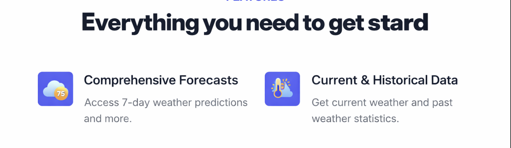
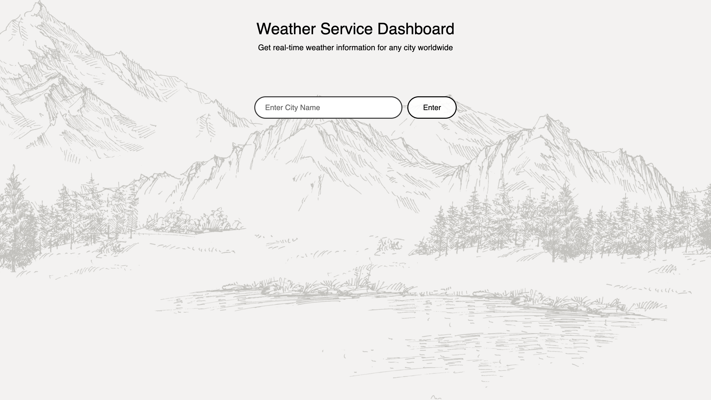
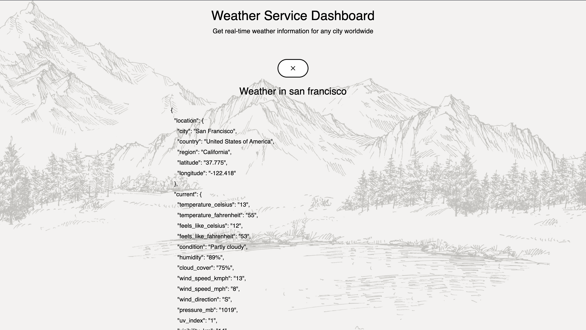
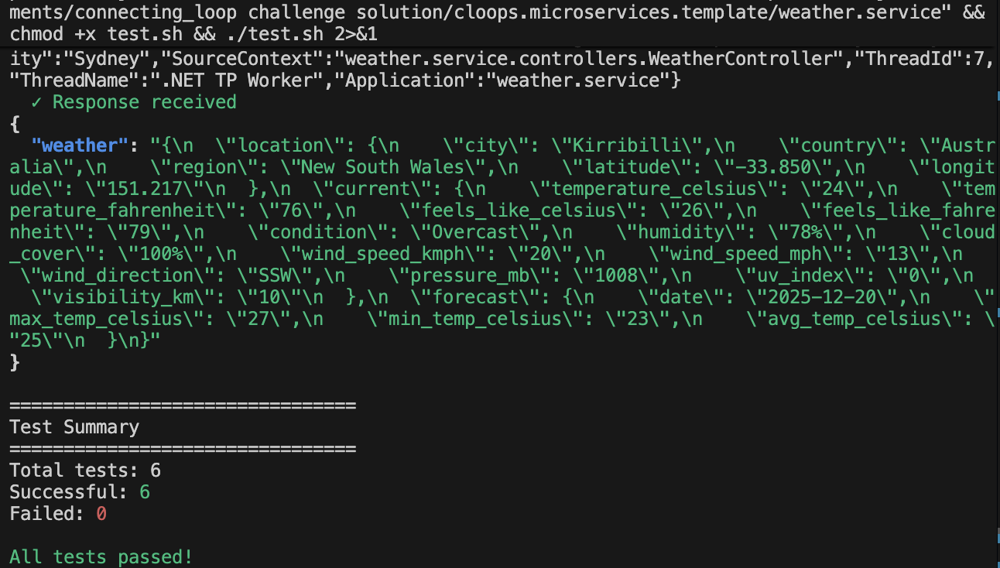

<div align="center">



</div>

<div align="center">


</div>

---

<div align="center">

# Weather API Microservice

</div>

## How to Run

### Prerequisites

- **.NET SDK 9.0** - [Download here](https://dotnet.microsoft.com)
- **Docker** - For NATS server
- **NATS CLI** - For testing (optional)

### Setup

**1. Clone the Repository**
```bash
git clone https://github.com/Poojakambale24/Weather-API.git
cd Weather-API
```

**2. Start NATS Server**
```bash
docker run -d --name nats-server -p 4222:4222 -p 8222:8222 nats:latest --jetstream
```

**3. Build and Run**
```bash
dotnet restore
dotnet build
export NATS_URL="nats://localhost:4222"
export ENABLE_NATS_CONSUMERS="true"
dotnet run
```

**4. Access the Service**
- **Web Dashboard**: http://localhost:5001
- **NATS Messaging**: `weather.request` subject

---

## How to Test

### Web Dashboard
Open http://localhost:5001 in your browser and enter any city name.

### NATS CLI
```bash
nats request weather.request '{"city": "San Francisco"}'
```

### Test Script
```bash
chmod +x test.sh
./test.sh
```

---

## Interface

<div align="center">



</div>

---

## Output

<div align="center">



</div>

---

## Test Results

<div align="center">



</div>

---

<div align="center">

**Built with ❤️ using .NET 9.0, NATS, and ASP.NET Core**

</div>
